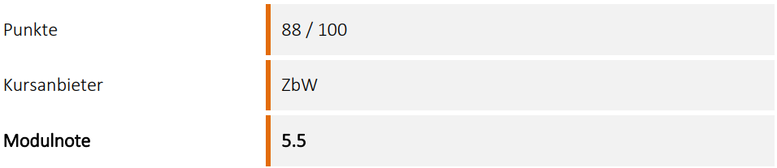
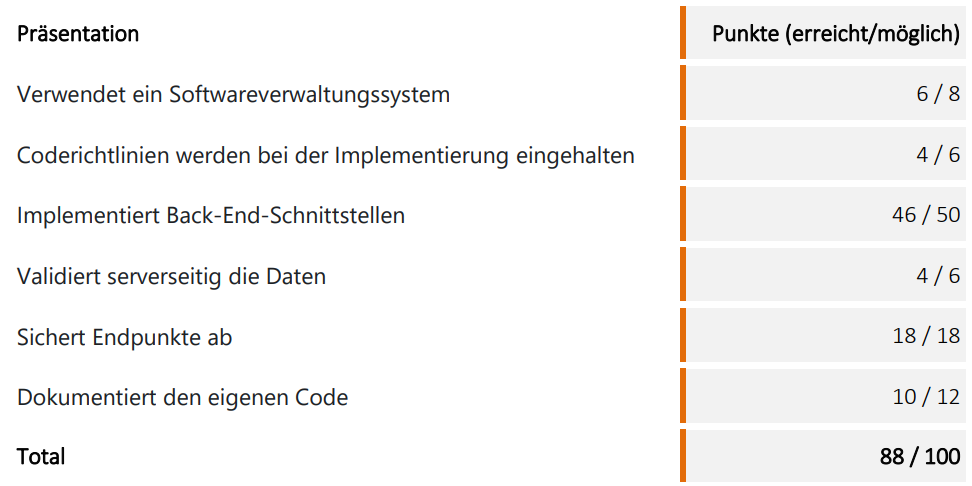

# **M295 – Zeiterfassung Backend API**

Diese Arbeit wurde im Rahmen des Moduls M295 "Backend für Applikationen realisieren" gemacht. ALs ich diesen Kurs gemacht hatte, gab es leider keine Beispiele, die einem eine Vorstellung der Prüfung geben. Daher habe ich beschlossen, mein Projekt zu veröffentlichen für mehr Transparenz für zukünftige Lehrlinge. Beiliegend noch meine Bewertung.

1. npm install (Warnungen ignorieren. Vieles wird bei euch bereits veraltete Versionen sein, läuft trotzdem)
2. npm run dev (startet das backend auf einem Localhost)





# **M295 – Zeiterfassung Backend API**

TypeScript · Express · SQLite · HTTPS · JWT · Multer · Rollenverwaltung · Dokument-Upload

Dies ist das vollständige Backendprojekt für die Modulprüfung **M295 (Backend-API)**.
Es implementiert ein vollständiges Zeiterfassungssystem mit:

- Benutzerverwaltung
- Authentifizierung (JWT)
- Rollen & Berechtigungen
- Zeitstempel (IN/OUT)
- Abwesenheiten inkl. Genehmigungsprozess
- Upload/Download/Löschen von Dokumenten pro Abwesenheit
- Änderungsprotokoll (Logs)
- HTTPS-Server
- Datenbank via Migrations + Seeders

---

# 📌 **Hauptfeatures**

### 🔐 **Authentication & Authorization**

- Login erstellt ein JWT
- Geschützte Routen via `verifyToken`
- Rollen: `admin`, `employee`
- `admin` kann:
  - Benutzer listen
  - Logs anzeigen
  - Dokumente löschen
  - Zeitstempel bearbeiten
  - Abwesenheiten genehmigen/ablehnen

---

### 🕒 **Zeiterfassung**

- Zeitstempel erstellen (IN/OUT)
- Zeitstempel aktualisieren (nur admin)
- Zeitstempel löschen (nur admin)

---

### 📅 **Abwesenheiten**

- Abwesenheit erstellen
- Aktuelle Benutzer-Abwesenheiten anzeigen
- Abwesenheit genehmigen/ablehnen (admin)

---

### 📄 **Dokumenten-Upload**

Pro Abwesenheit können mehrere Dokumente hochgeladen werden:

- Upload (`POST /absences/:id/documents`)
- Liste (`GET /absences/:id/documents`)
- Download (`GET /absences/:id/documents/:filename`)
- Delete (`DELETE /absences/:id/documents/:filename`)

Speicherort:

```
/files/<absenceId>/<serverFileName>
```

---

### 📝 **Änderungsprotokoll (Logs)**

- Jeder administrative Eingriff wird geloggt
- Logs können via `/logs` eingesehen werden (nur admin)

---

# 📦 **Technologien**

- Node.js 18+
- TypeScript
- Express
- Multer (Dateiupload)
- SQLite3
- JWT
- HTTPS Server
- Winston Logger

---

# 🛠️ **Installation**

```bash
npm install
```

---

# ▶️ **Server starten**

### Entwicklung:

```bash
npm run dev
```

### Produktion:

```bash
npm start
```

Server läuft unter:

```
https://localhost:5001
```

Zertifikate liegen in:

```
cert/server.key
cert/server.crt
```

---

# 🗄 **Datenbank**

Beim Serverstart werden automatisch:

- **Migrations** ausgeführt → erzeugen Tabellen
- **Seeders** ausgeführt → erzeugen Admin & Testdaten

### 📁 Verzeichnisstruktur:

```
data/
 ├─ migrations/
 ├─ seeders/
 └─ database.sqlite3
```

---

# 🔐 **Authentifizierung**

### Login:

```
POST /login
{
  "username": "admin",
  "password": "hallo123456"
}
```

Antwort:

```json
{
  "token": "<JWT>",
  "user": {
    "id": 1,
    "role": "admin"
  }
}
```

### Logout:

```
POST /logout
```

### Token senden:

```
Authorization: Bearer <JWT>
```

---

# 🧪 **API – Übersicht wichtiger Endpunkte**

## 🔐 Auth

| Methode | Endpoint  | Beschreibung    |
| ------- | --------- | --------------- |
| POST    | `/login`  | Token erzeugen  |
| POST    | `/logout` | Session beenden |

---

## 👤 Benutzer

| Methode | Endpoint           | Hinweise                            |
| ------- | ------------------ | ----------------------------------- |
| GET     | `/users`           | admin                               |
| GET     | `/users/:id`       | eigenes Profil oder admin           |
| GET     | `/users/:id/saldo` | berechneter Zeit-/Abwesenheitssaldo |

---

## 🕒 Zeitstempel (Time Entries)

| Methode | Endpoint            | Beschreibung    |
| ------- | ------------------- | --------------- |
| POST    | `/time-entries`     | IN/OUT stempeln |
| PUT     | `/time-entries/:id` | admin           |
| DELETE  | `/time-entries/:id` | admin           |

---

## 📅 Abwesenheiten

| Methode | Endpoint        | Beschreibung                |
| ------- | --------------- | --------------------------- |
| POST    | `/absences`     | Antrag erstellen            |
| GET     | `/absences`     | Eigene Anträge              |
| PUT     | `/absences/:id` | Genehmigen/ablehnen (admin) |

---

## 📄 Dokumente pro Abwesenheit

| Methode | Endpoint                            | Beschreibung      |
| ------- | ----------------------------------- | ----------------- |
| POST    | `/absences/:id/documents`           | Dateien hochladen |
| GET     | `/absences/:id/documents`           | Dokumentliste     |
| GET     | `/absences/:id/documents/:filename` | Download          |
| DELETE  | `/absences/:id/documents/:filename` | admin             |

Dokumente werden wie folgt gespeichert:

```
files/<absenceId>/<serverFilename>
```

---

## 📜 Logs

| Methode | Endpoint | Hinweise   |
| ------- | -------- | ---------- |
| GET     | `/logs`  | admin-only |

---

# 🔧 **Projektstruktur**

```
src/
 ├─ app.ts
 ├─ server.ts
 ├─ logger.ts
 ├─ config/
 ├─ controllers/
 ├─ middleware/
 ├─ repo/
 ├─ models/
 ├─ types/
 └─ routes/
files/
 └─ <absenceId>/
logs/
 ├─ combined.log
 └─ error.log
data/
 ├─ migrations/
 ├─ seeders/
 └─ database.sqlite3
cert/
 ├─ server.key
 └─ server.crt
```

---

# 🛠️ **Troubleshooting**

| Problem              | Ursache                  | Lösung                           |
| -------------------- | ------------------------ | -------------------------------- |
| 401 Unauthorized     | Kein Token gesendet      | Header setzen                    |
| 403 Forbidden        | Keine Admin-Rolle        | admin nutzen                     |
| Upload schlägt fehl  | falsches Multipart-Feld  | Feldname: `documents`            |
| Datei nicht gefunden | falscher filename        | filename aus GET-Liste verwenden |
| Seeders doppelt      | DB löschen → neu starten | `database.sqlite3` löschen       |

# **Ablaufdiagramm**

![[assets/Diagram.svg]]

Hier ist das **API-Testprotokoll als vollständig formatiertes Markdown-Dokument**, bereit zum Kopieren oder als README-Anhang zu verwenden:

---

# 📋 API – Testprotokoll (M295 Zeiterfassung)

**Test – Durchführung – Datum und Zeit:**
**Name:**

---

## ✅ Übersicht der Testfälle

| Nr. | **Kriterium** | **Endpoint**                        | **Methode** | **Beschreibung**                                  | **Test erfolgreich** | **Kommentar / Fehlerhinweis** |
| --- | ------------- | ----------------------------------- | ----------- | ------------------------------------------------- | :------------------: | ----------------------------- |
| 1   | User          | `/login`                            | POST        | Authentifiziert den Benutzer und erstellt ein JWT |        [✔/✘]         |                               |
| 2   | User          | `/logout`                           | POST        | Beendet die Session / Token ungültig machen       |        [✔/✘]         |                               |
| 3   | User          | `/users`                            | GET         | Liste aller Benutzer (nur Admin)                  |        [✔/✘]         |                               |
| 4   | User          | `/users/:id`                        | GET         | Details eines bestimmten Benutzers                |        [✔/✘]         |                               |
| 5   | Summen-View   | `/users/:id/saldo`                  | GET         | Zeigt Zeit- und Abwesenheitssaldo                 |        [✔/✘]         |                               |
| 6   | Zeitstempel   | `/time-entries`                     | POST        | Neuen IN/OUT-Zeitstempel erstellen                |        [✔/✘]         |                               |
| 7   | Zeitstempel   | `/time-entries/:id`                 | PUT         | Zeitstempel aktualisieren (nur Admin)             |        [✔/✘]         |                               |
| 8   | Zeitstempel   | `/time-entries/:id`                 | DELETE      | Zeitstempel löschen (nur Admin)                   |        [✔/✘]         |                               |
| 9   | Abwesenheiten | `/absences`                         | POST        | Abwesenheitsantrag erstellen                      |        [✔/✘]         |                               |
| 10  | Abwesenheiten | `/absences`                         | GET         | Listet alle Abwesenheiten des Benutzers           |        [✔/✘]         |                               |
| 11  | Abwesenheiten | `/absences/:id`                     | PUT         | Status aktualisieren (Genehmigen/Ablehnen)        |        [✔/✘]         |                               |
| 12  | Dokumente     | `/absences/:id/documents`           | POST        | Datei(en) zu Abwesenheit hochladen                |        [✔/✘]         |                               |
| 13  | Dokumente     | `/absences/:id/documents`           | GET         | Listet alle Dokumente der Abwesenheit             |        [✔/✘]         |                               |
| 14  | Dokumente     | `/absences/:id/documents/:filename` | GET         | Download eines bestimmten Dokuments               |        [✔/✘]         |                               |
| 15  | Dokumente     | `/absences/:id/documents/:filename` | DELETE      | Löscht ein bestimmtes Dokument (Admin)            |        [✔/✘]         |                               |
| 16  | Protokoll     | `/logs`                             | GET         | Zeigt Änderungsprotokolle (nur Admin)             |        [✔/✘]         |                               |

---

## ✍️ Hinweise zur Durchführung

- Tests werden mit **Postman** durchgeführt
- Vor jedem Test **gültiges JWT** setzen:

  ```
  Authorization: Bearer <token>
  ```

- Für Datei-Uploads:

  ```
  Body → form-data → Key: "documents" → Type: File
  ```

---
